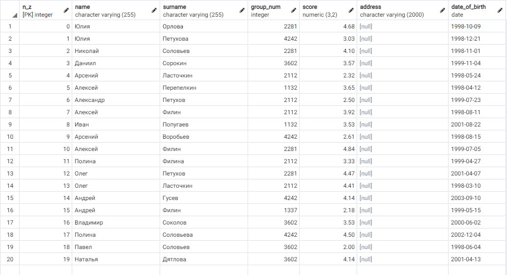
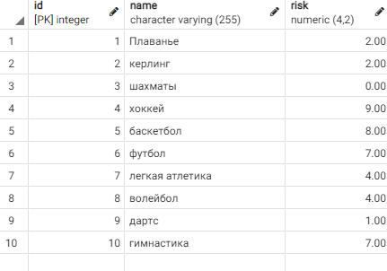
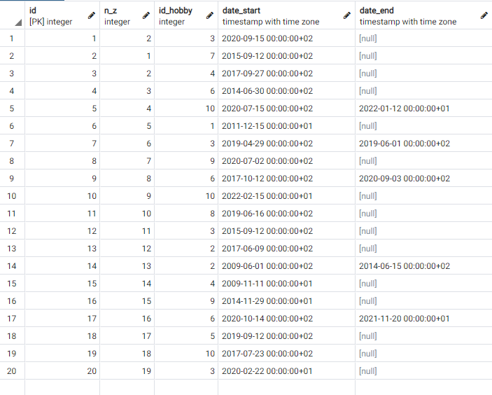

# Задание 1

# Основная часть
## Таблица "Студенты"
Создадим таблицу для хранения информации о студентах, ключом является номер зачетки. Все поля должны быть заполнены
### Атрибуты:
1 - Номер зачетки

2 - Имя студента

3 - Фамилия студента

4 - Номер группы

5 - Средний балл

6 - Адрес проживания

7 - Дата рождения


Код для создания таблицы:
```SQL
CREATE TABLE "students" (
	"n_z" INTEGER NOT NULL,
	"name" VARCHAR(255) NOT NULL,
	"surname" VARCHAR(255) NULL DEFAULT NULL,
	"group_num" INTEGER NULL DEFAULT NULL,
	"score" NUMERIC(3,2) NULL DEFAULT NULL,
	"address" VARCHAR(2000) NULL DEFAULT NULL,
	"date_of_birth" DATE NULL DEFAULT NULL,
	PRIMARY KEY ("n_z"),
	CONSTRAINT "group_num" CHECK ((((group_num <= 9999) AND (group_num >= 1000)))),
	CONSTRAINT "score" CHECK ((((score >= (2)::numeric) AND (score <= (5)::numeric))))
);
```

## Таблица "Хобби"
Создаем таблицу с хобби студентов. Ключом будет являтся идентификатор хобби. Ограничим возмыжные риски у разных видов хобби
### Атрибуты
1 - ID хобби

2 - Название

3 - Фактор риска

Код для создания таблицы:
```SQL
CREATE TABLE public.hobby
(
    id integer NOT NULL,
    name character varying(255) COLLATE pg_catalog."default" NOT NULL,
    risk numeric(4,2) DEFAULT NULL::numeric,
    CONSTRAINT hobby_pkey PRIMARY KEY (id),
    CONSTRAINT risk CHECK (risk >= 0::numeric AND risk <= 10::numeric)
)
```
## Таблица "Хобби студентов"
Создадим таблицу для сопоставления судента и хобби которым он увлекается. Первичным ключом будет являться идентификатор записи. А внешними ключами номер зачетки и порядковый номер хобби (id)

### Атрибуты
 1 - ID записи

2 - Номер зачетки студента (Внешний ключ)

3 - ID хобби (Внешний ключ)

4 -  Время начала

5 -  Время окончания


Код для создания таблицы:
```SQL
CREATE TABLE public.student_hobby
(
    id integer NOT NULL,
    n_z integer NOT NULL,
    id_hobby integer NOT NULL,
    date_start timestamp with time zone,
    date_end timestamp with time zone,
    CONSTRAINT student_hobby_pkey PRIMARY KEY (id),
    CONSTRAINT hobby_id FOREIGN KEY (id_hobby)
        REFERENCES public.hobby (id) MATCH SIMPLE
        ON UPDATE NO ACTION
        ON DELETE NO ACTION,
    CONSTRAINT n_z FOREIGN KEY (n_z)
        REFERENCES public.students (n_z) MATCH SIMPLE
        ON UPDATE NO ACTION
        ON DELETE NO ACTION
)
```

# Заполняем таблицы
## Студенты
Изначально заполняем таблицу "Студенты". Для заполнения таблицы я использовал [скрипт](dbfill.py). Скрипт автоматически запоняет таблицу рандомными данными. Использется значение `%s`, которое задавается скриптом.
```SQL
INSERT INTO "students" (
    "n_z", 
    "name", 
    "surname", 
    "group_num", 
    "score", 
    "date_of_birth"
) 
VALUES 
    (%s,%s,%s,%s,%s,%s)
```
Получается таблица заполненная данными со студентами:  


## Хобби
Данную таблицу заполнял вручную, прописывал id для каждого hobby, названия и их возможные риски по делятибальной шкале.

## Сопоставление студентов с хобби
Данная таблица заполнялась вручную, заполнялось id студента, его хобби и время, когда он начал увлекаться чем-либо, и время, когда он закончил свою деятельность(если таковое имеется), после чего с помощью SQL - запроса, приведенного ниже, данные добавляются в таблицу. Так как мы берем существующие ID студента и хобби, условия внешних ключей удовлетворяются.
```SQL
INSERT INTO "student_hobby" (
    "n_z", 
    "id_hobby", 
    "date_start", 
    "date_end"
) 
VALUES
(id, n_z, id_hobby, date_start, date_end)
```
> `date_end` может быть `NULL` - это означает то, что студент все еще занимается этим хобби на данный момент
Получаем следующую таблицу:  


# Заключение
В результате выполненных действий мы получили:  
1 - Таблицу данных о студентах

2 - Таблицу существующих хобби

3 - Таблицу ассоциаций между студентами и хобби, которыми они занимаются
