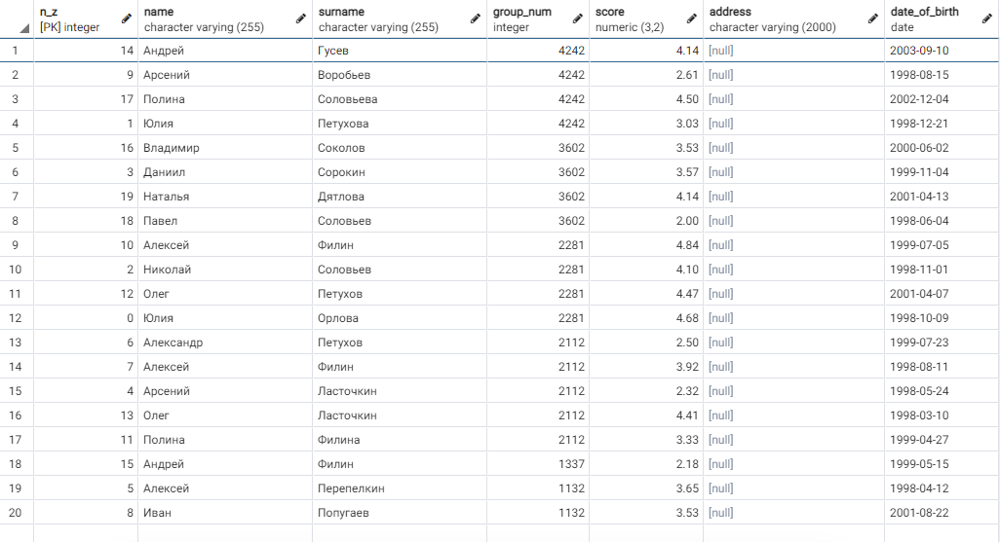

# Однотабличные запросы

# Запросы
## Вывести всеми возможными способами имена и фамилии студентов, средний балл которых от 4 до 4.5
   
`SELECT` - получаем строки из таблицы.  
`FROM ...` - таблица, из которой получаем данные.  
`WHERE ...` - критерии, определяющие, какие строки вернутся.
```SQL
SELECT name,surname FROM students WHERE score >= 4.0 AND score <= 4.5
```
  

## Познакомиться с функцией CAST. Вывести при помощи неё студентов заданного курса (использовать Like)
Исполняем SQL-запрос. Можно сделать разными вариантыми, но сделаем 2-мя вариантами.  
`CAST (... AS ...)` - изменяет тип переменной, указанной в первом параметре на тип, указанный во втором параметре.    
Функции `CAST (st.group_num AS VARCHAR)` и `st.group_num::VARCHAR` идентичны друг другу.  
`LEFT(..., ...)` - возвращает указанное количество символов с левого конца строки.  
`... LIKE ...` - проверяет соответствие строки указанному шаблону. Возможна запись как `... ~~ ...`   
### Шаблоны LIKE
 - `%` - соответствует нулю или более символов
 - `_` - соотвествует строго одному символу
```SQL
SELECT * FROM students st WHERE LEFT(st.group_num::VARCHAR,1) = '2'
```

```SQL
SELECT * FROM students st WHERE CAST(st.group_num AS VARCHAR) LIKE '2%'
```
Оба запроса возвращают одинаковый результат.  
  

## Вывести всех студентов, отсортировать по убыванию номера группы и имени от А до Я
   
`ORDER BY ...` - порядок, в котором вернутся запрошенные записи.  
Может иметь несколько критериев, разделенных запятой.  
`... ASC` после критерия - отсортировать по возрастанию, `... DESC` - отсортировать по убыванию.  
```SQL
SELECT * FROM students st ORDER BY st.group_num DESC, st.name
```
    

## Вывести студентов, средний балл которых больше 4, и отсортировать по баллу от большего к меньшему
   
Объединяем параметры `WHERE` и `ORDER BY` в одном запросе.  
```SQL
SELECT * FROM students st WHERE st.score >= 4.0 ORDER BY st.score DESC
```
   

## Вывести на экран название и риск.
Хоккей отсутствует в базе хобби, заменим его на бокс.  
   
```SQL
SELECT h.name, h.risk FROM hobby h WHERE h.name = 'хоккей' OR h.name = 'шахматы'
```
   

## Вывести ID хобби и ID студента, которые начали заниматься хобби между двумя заданными датами и студенты должны до сих пор заниматься хобби
   
С помощью `WHERE` устанавливаем диапазон дат начала, и используя проверку `IS NULL` проверяем, что студент все еще занимается хобби.  
```SQL
SELECT st_h.n_z, st_h.id_hobby FROM student_hobby st_h WHERE st_h.date_start > '2020-07-15' AND st_h.date_start < '2022-01-12' AND st_h.date_end IS NULL
```
   

## Вывести студентов, средний балл которых больше 4.5 и отсортировать по баллу от большего к меньшему
   
```SQL
SELECT * FROM students st WHERE st.score >= 4.5 ORDER BY st.score DESC
```
    

## Из предыдущего запроса вывести несколькими способами на экран только 5 студентов с максимальным баллом
Так как студентов всего 5, выводим только первых трех.  
   
`LIMIT ...` ограничивает количество возвращаемых строк.  
```SQL
SELECT * FROM students st WHERE st.score >= 4.5 ORDER BY st.score DESC LIMIT 3
```
Оба запроса возвращают одинаковый результат.  
    

## Выведите хобби и с использованием условного оператора сделайте риск словами
   
`CASE ... END` позволяет сравнить некое значение сразу с несколькими условиями.  
`WHEN ... THEN ...` - условная конструкция, которая возвращает значение после `THEN`, если удовлетворяется заданное условие.  
```SQL
SELECT h.name,
CASE 
WHEN h.risk < 2 THEN 'Очень низкий'
WHEN h.risk >= 2 AND h.risk < 4 THEN 'Низкий'
WHEN h.risk >= 4 AND h.risk < 6 THEN 'Средний'
WHEN h.risk >= 6 AND h.risk < 8 THEN 'Высокий'
WHEN h.risk >= 8 THEN 'Очень высокий'
END risk
FROM hobby h 
```
    

## Вывести 3 хобби с максимальным риском
   
```SQL
SELECT * FROM hobby h ORDER BY h.risk DESC LIMIT 3
```
   