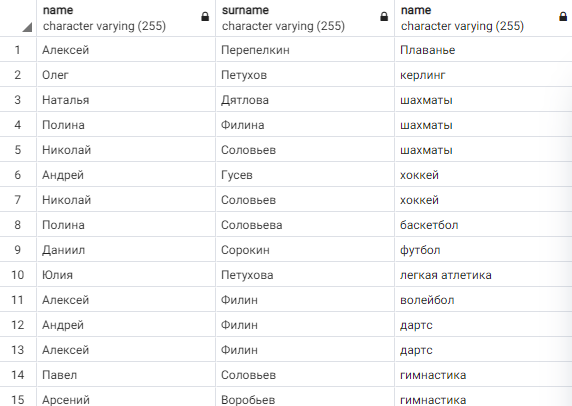
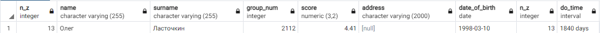
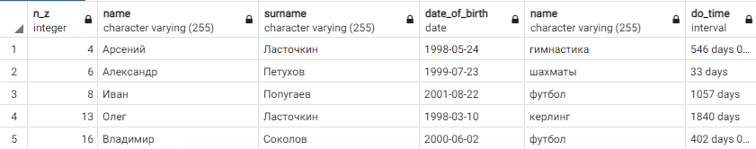
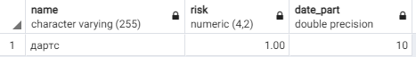

# Многотабличные запросы
# Запросы
## Вывести все имена и фамилии студентов, и название хобби, которым занимается этот студент
Нужно обратиться к 3 таблицам одновременно, чтобы получить необходимые данные.
Делаем проверку `IS NULL`, чтобы убедиться в том, что студент до сих пор заниаемтся свим хобби, без нее получится список всех студентов только с данными начала их занятия.
```SQL
SELECT 
  st.name, st.surname, h.name 
FROM students st, student_hobby sth, hobby h 
WHERE 
  st.n_z = sth.n_z AND 
  sth.id_hobby = h.id AND 
  sth.date_end IS NULL
```
  
  

## Вывести информацию о студенте, занимающимся хобби самое продолжительное время
Объединим таблицу студентов и времы их занятия хобби, после чего возвращаем студента, занимавшегося хобби самое продолжительное время.  
`INNER JOIN ... ON ...` присоединяет к исходной таблице атрибуты из второй, где заданное выражение совпадает.  

```SQL
SELECT * FROM students st 
INNER JOIN 
  (SELECT 
    sth.n_z, 
    sth.date_end - sth.date_start do_time 
  FROM student_hobby sth 
  WHERE sth.date_end - sth.date_start IS NOT NULL) sth 
ON st.n_z = sth.n_z 
ORDER BY do_time DESC 
LIMIT 1
```
  
  

## Вывести фамилию, имя, зачетку, дату рождения, название хобби и длительность в месяцах, для всех завершенных хобби
 
Объединим таблицу студентов и времы их занятия хобби, после чего возвращаем студента и добавляем данные о времени, сколько студент занимался хобби.  
```SQL
SELECT st.n_z, st.name, st.surname, st.date_of_birth, h.name, sth.do_time FROM students st 
INNER JOIN 
  (SELECT 
    sth.n_z, 
    sth.id_hobby,
    sth.date_end - sth.date_start do_time 
  FROM student_hobby sth 
  WHERE sth.date_end - sth.date_start IS NOT NULL) sth 
ON st.n_z = sth.n_z 
INNER JOIN hobby h
ON sth.id_hobby = h.id
```
  
  

## Вывести фамилию, имя, зачетку, дату рождения студентов, которым исполнилось N полных лет на текущую дату, и которые имеют более 1 действующего хобби.
 
Возмем студента, например, которому исполнилось 21 год  
`EXTRACT` в `WHERE` возвращает количество дней, прошедших между текущей датой и датой рождения студента.  
```SQL
SELECT st.n_z, st.name, st.surname, st.date_of_birth
FROM students st,
  (SELECT st.n_z
  FROM students st
  INNER JOIN
    (SELECT *
      FROM student_hobby sth
      WHERE sth.date_end IS NOT NULL) sth
  ON st.n_z = sth.n_z
  GROUP BY st.n_z
  HAVING COUNT(st.n_z) > 1) multhobby
WHERE 
  EXTRACT(DAYS FROM NOW() - st.date_of_birth)/365 > 21 AND 
  st.n_z = multhobby.n_z
```
 
*В таблице не получается почему-то вывести результат*
  

## Найти название, риск, длительность в месяцах самого продолжительного хобби из действующих, указав номер зачетки студента.
 
Возвращаем данные для студента с номером зачетки `7`.  
```SQL
SELECT h.name, h.risk, EXTRACT(MONTH FROM age(NOW(),sth.date_start))
FROM students st
INNER JOIN 
  (SELECT * FROM student_hobby sth
     WHERE sth.date_end IS NULL) sth
ON st.n_z = sth.n_z
INNER JOIN hobby h
ON sth.id_hobby = h.id
WHERE st.n_z = 2
ORDER BY DATE_PART DESC
LIMIT 1
```
  
  